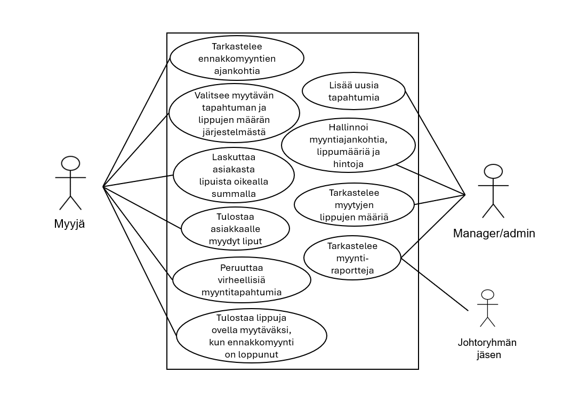
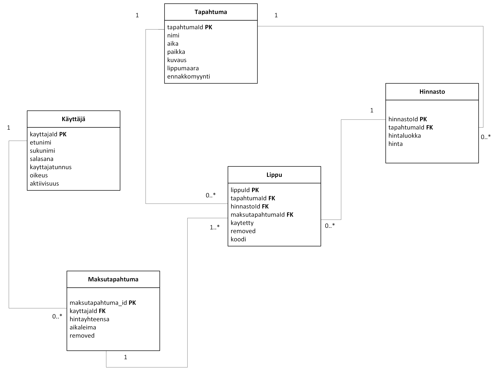

# Projektidokumentaatio

### Tiimi: 
Hiltunen Ilona, Järvinen Juho, Keinänen Aleksi, Klenberg Eriika, Nevala Sanni

## Johdanto

Kyseessä on Haaga-Helia ammattikorkeakoulun Ohjelmistoprojekti 1-kurssitoteutuksen projektityö (syksy 2024), jossa luotiin kuvitteellisen asiakkaan tilaama lipunmyyntijärjestelmä.

Käyttöliittymä on toteutettu repositorioon https://github.com/AbuAk1/op1-client.

### Järjestelmä

Asiakkaana toimii lipputoimisto, joka tarvitsee lipunmyyntijärjestelmän myyntipisteeseen. Lipputoimiston myyjä myy ja tulostaa asiakkailleen liput tapahtumiin lipunmyyntijärjestelmästä. Lipputoimisto voi lisätä ja muokata lipunmyyntijärjestelmässä tapahtumia ja myytävien lippujen tietoja sekä nähdä koostetusti myyntitapahtumat ja myyntiraportit. Lipuissa on QR-koodit, jotta liput voidaan merkitä käytetyksi asiakkaan saapuessa tapahtumaan. 

### Toteutus- ja toimintaympäristö

Projektissa tulemme käyttämään GitHubia versionhallintaan ja kehitystyöhön. Toimintaympäristömme pohjautuu Java-teknologioihin. Hyödynnämme Spring Boot-sovelluskehystä sekä palvelinpuolella toteutamme REST API-rajapinnan.
Käyttöliittymäteknologioista hyödynnämme React-kirjastoa. Järjestelmä on julkaistu Rahti2-palvelimelle.

## Järjestelmän määrittely

### Käyttäjäryhmät 

Järjestelmässä on user- ja admin-tason käyttäjiä. Lipunmyynnissä työskentelevillä myyjillä on user-käyttäjän suppeammat oikeudet, joilla voi luoda ja peruuttaa myyntitapahtumia, tulostaa sekä asiakkaan ostamat liput että ennakkomyynnin loputtua loput jäljelle jääneet liput ovimyyntiä varten. User voi tarkistaa onko lippu käyttämätön ja merkitä sen käytetyksi. Myymäläpäälliköllä sekä yrityksen johtoryhmän jäsenillä on admin-tason oikeudet, joilla voi User-käyttäjän oikeuksien lisäksi lisätä uusia tapahtumia, hallinnoida ja tarkastella tapahtuman tietoja sekä tarkastella myyntiraportteja. Admin voi hallita käyttäjiä tietokannasta käsin.

### Käyttötapauskaavio 



### Käyttötapausten kuvaus

Järjestelmän olennaisin tarkoitus on myydä sekä tulostaa asiakkaan haluama määrä lippuja oikeaan tapahtumaan. Myyntitapahtumaan liittyy olennaisesti hinnan hakeminen tietokannasta sekä mahdollisuus peruuttaa jo tehtyä maksutapahtumia. Tapahtuma ja sen hinnastot täytyy olla luotu ennen kuin lippuja aletaan myymään. Jos lippuja jää myymättä ennakkomyyntijakson aikana, loput liput tulostetaan ovimyyntiä varten.

Yritystoimintaa ylläpitäville tahoille on tärkeää saada tietoa tapahtumista esimerkiksi yrityksen talouden hoitamisen vuoksi, joten järjestelmästä tulee pystyä näkemään tapahtumien tietoja kuten myytyjen lippujen määrää. Lisäksi mahdollisissa muutostilanteissa tulee tapahtuman tietoja pystyä muokkaamaan, jotta järjestelmän tieto ei ole virheellistä. Jo järjestetyissä tapahtumissa muokkaus ei kuitenkaan ole enää mahdollista.

## Käyttöliittymä

Käyttöliittymän tärkeimmät näkymät ja niiden väliset siirtymät on esitelty käyttöliittymäkaavioina projektin käyttöliittymän repositoriossa  [op1-client](https://github.com/AbuAk1/op1-client?tab=readme-ov-file#k%C3%A4ytt%C3%B6liittym%C3%A4n-keskeiset-toiminnot).

## Tietokanta

### Luokkakaavio



> ### _Tapahtuma_
> _Tapahtuma-taulu sisältää myynnissä olevat tulevat tapahtumat, sekä jo järjestetyt tapahtumat. Tapahtumaan voi olla monia myytyjä lippuja, mutta lipun tapahtumia voi olla vain yksi. Admin luo uusia tapahtumia myytäväksi._
>
> Kenttä | Tyyppi | Kuvaus
> ------ | ------ | ------
> tapahtumaId | int PK | Tapahtuman id
> nimi | varchar(60) | Tapahtuman nimi
> aika | date | Tapahtuman päivämäärä
> paikka | varchar(60) | Tapahtuman sijainti
> kuvaus | varchar(500) | Tapahtuman kuvaus
> lippumaara | int | Kuinka paljon lippuja on myynnissä
> ennakkomyynti | date | Päivämäärä, jolloin lippujen ennakkomyynti loppuu

> ### _Hinnasto_
> _Hinnasto-taulu sisältää tapahtuman hinnastoluokat. Tapahtumalla voi olla useita hintaluokkia, mutta hintaluokka voi kuulua vain yhteen tapahtumaan. Hinnastoja voi luoda vain Admin-roolissa._
>
> Kenttä | Tyyppi | Kuvaus
> ------ | ------ | ------
> hinnastoId | int PK | Hinnaston id
> tapahtumaId | int FK | Viittaus tapahtumaan [Tapahtuma](#Tapahtuma)-taulussa
> hintaluokka | varchar(30) | Hintaluokka esim. opiskelija
> hinta | double | Hinta

>  ### _Lippu_
> _Lippu-taulu sisältää lipun tiedot. Lippu taulu yhdistyy Tapahtuma- ja Hinnasto-tauluihin. Yhdellä lipulla on yksi hinta ja yksi tapahtuma. Lippuja voi myydä sekä Admin- että User-rooleissa._
>
> Kenttä | Tyyppi | Kuvaus
> ------ | ------ | ------
> lippuId | int PK | Lipun id
> tapahtumaId | int FK | Viittaus tapahtumaan [Tapahtuma](#Tapahtuma)-taulussa
> hinnastoId | int FK | Viittaus hinnastoon [Hinnasto](#Hinnasto)-taulussa
> maksutapahtumaId | int FK | Viittaus maksutapahtumaan [Maksutapahtuma](#Maksutapahtuma)-taulussa
> kaytetty | boolean | Oletuksena false, muutetaan lipuntarkastuksessa true:ksi
> removed | boolean | Lipun soft delete, oletuksena false
> koodi | string | UUID-koodi Qr-koodia varten
> luontiaika | timestamp | Lipun luontiaika QR-koodin generoimiseen

>  ### _Käyttäjä_
> _Käyttäjä-taulu sisältää ohjelman käyttäjien tiedot. Ohjelman käyttäjiä ovat esimerkiksi myyjä ja manageri._
>
> Kenttä | Tyyppi | Kuvaus
> ------ | ------ | ------
> kayttajaId | int PK | Käyttäjän id
> etunimi | varchar(30) | Ohjelmaa käyttävän henkilön etunimi
> sukunimi | varchar(30) | Ohjelmaa käyttävän henkilön sukunimi
> salasana | varchar(256) | Ohjelmaa käyttävän henkilön tunnuksen salasana
> kayttajatunnus | varchar(30) | Ohjelmaa käyttävän henkilön tunnuksen käyttäjätunnus
> oikeus | varchar(30) | Ohjelmaa käyttävän henkilön oikeudet, user tai admin
> aktiivisuus | boolean | Oletuksena true, muutetaan false, jos ei enää työskentele yrityksessä

> ### _Maksutapahtuma_
> _Maksutapahtuma-taulu sisältää maksutapahtumat. Maksutapahtumalla voi olla yksi käyttäjä. Käyttäjällä voi olla useita maksutapahtumia. Lippuja voi myydä sekä Admin- että User-rooleissa._
>
> Kenttä | Tyyppi | Kuvaus
> ------ | ------ | ------
> maksutapahtumaId | int PK | Maksutapahtuman id
> kayttajaId | int FK | Viittaus käyttäjään [Käyttäjä](#Käyttäjä)-taulussa
> hintayhteensa | double |  Lippujen hinnat yhteensä
> aikaleima | date | Maksutapahtuman aikaleima
> removed | boolean | Maksutapahtuman soft delete, oletuksena false (true/false)

## Tekninen kuvaus


### Teknologiat
- Java
- Spring Boot: Java-pohjainen kehys
- Spring Security: Autentikointi ja auktorisointi
- Spring data JPA: Tietokantakäsittely ja integrointi
- Tietokanta
    - H2: kehityksessä ja testeissä
    - MySQL: tuotannossa
- JSON Web Tokens: Käyttäjien autentikointi ja oikeudet
- Spring Boot DevTools
- Spring Boot Starter Test: yksikkö ja integraatiotestaus
    - JUnit 5
    - Mockito
- Bean Validation: Tietojen validointi
- Spring Boot Starter Web: RESTful API:n rakentaminen
- Spring Security Test: Spring Security:n testaus

### Julkaisu
Sovellus on julkaistu CSC Rahti-palvelussa. Sovellus on konfiguroitu käyttämään Dockerfile-tiedostoa sekä tuotantoympäristöön tarkoitettua application-prod.properties-tiedostoa tietokannan asetuksille. Alle on liitetty mainittujen tiedostojen sisällöt.

- Dockerfile
```
FROM eclipse-temurin:17-jdk-focal AS builder
WORKDIR /opt/app
COPY .mvn/ .mvn
COPY mvnw pom.xml ./
RUN chmod +x ./mvnw
RUN ./mvnw dependency:go-offline
COPY ./src ./src
RUN ./mvnw clean install -DskipTests 
RUN find ./target -type f -name '*.jar' -exec cp {} /opt/app/app.jar \; -quit

FROM eclipse-temurin:17-jre-alpine
COPY --from=builder /opt/app/*.jar /opt/app/
EXPOSE 8080
ENTRYPOINT ["java", "-jar", "/opt/app/app.jar" ]
```
- MySQL-tietokannan konfigurointi
    - application-prod.properties
```
spring.jpa.show-sql=true
spring.datasource.driver-class-name=com.mysql.cj.jdbc.Driver
spring.datasource.url=${DB_URL}
spring.datasource.username=${DB_USERNAME}
spring.datasource.password=${DB_PASSWORD}
spring.datasource.initialization-mode=create-drop
spring.jpa.properties.hibernate.dialect=org.hibernate.dialect.MySQLDialect
spring.jpa.generate-ddl=true
spring.jpa.hibernate.ddl-auto=update
```

### Rajapintojen kuvaukset
[Rajapintojen kuvaukset](documents/Rajapinnankuvaus/RESTAPIdokumentaatio.md) ovat erillisessä tiedostossa. 

UML-sekvenssikaavio 

```
Client              REST API                    Server                   MySQL
  |                    |                          |                       |
  |  POST /api/login   |                          |                       |
  | ---------------->  |                          |                       |
  |                    |      Validate user       |                       |
  |                    |   ------------------>    |                       |
  |                    |                          |                       |
  |                    |   Generate JWT Token     |                       |
  |                    |   <-------------------   |                       |
  | 200 OK, JWT Token  |                          |                       |
  | <----------------  |                          |                       |
  |                    |                          |                       |
  |   GET /api/data    |                          |                       |
  |     with JWT       |                          |                       |
  | ---------------->  |    Validate JWT Token    |                       |
  |                    |    ---------------->     |                       |
  |                    |    Query data from DB    |                       |
  |                    |    ---------------->     |                       |
  |                    |                          |                       |
  |                    |                          |  Return data from DB  |
  |                    |                          |   <---------------    |
  |                    |    Return data to API    |                       |
  |                    |    <-----------------    |                       |
  |    200 OK, Data    |                          |                       |
  | <----------------  |                          |                       |
  |                    |                          |                       |

```

### Turvallisuus
Salasana:
- Kun käyttäjä luo tilin, salasana salataan Spring Securityn tarjoamalla PasswordEncoder-rajapinnalla, jonka ansiosta salasanat eivät tallennu selväkielisenä tietokantaan.

JWT token:

- Kun käyttäjä kirjautuu sisään login-endpointissa, palvelin luo JWT-tokenin, joka sisältää käyttäjän tunnistetiedot (käyttäjätunnus ja rooli) sekä tokenin voimassaoloajan. Token palautetaan käyttäjälle ja tämä lisätään kaikkiin seuraaviin HTTP-pyyntöihin, jotka vaativat autentikointia.
- Token tallennetaan selaimen localStorageen, joka varmistaa, että käyttäjän ei tarvitse kirjautua aina, kun tekee pyynnön. Kun käyttäjä tekee pyynnön suojattuihin endpointteihin, token lähetetään pyynnön mukana.
    - Palvelin tarkistaa tokenin aitouden ja varmistaa, että se ei ole vanhentunut. Jos token on voimassa ja oikea, käyttäjä voidaan tunnistaa ja hänelle voidaan antaa pääsy pyydetylle resurssille.
    - Tokenissa on käyttäjän roolitiedot, joiden perusteella sovellus päättää, mitä resursseja käyttäjä voi käyttää. Esimerkiksi admin-käyttäjällä on pääsy hallintaan, mutta tavallisella käyttäjällä ei.
- JWT-tokenit sisältävät voimassaoloajan. Kun token vanhenee, käyttäjän täytyy kirjautua sisään uudelleen.
- Sovelluksesta uloskirjautuminen varmistaa, että käyttäjä voi turvallisesti kirjautua ulos kaikista istunnoista sekä JWT-token samalla mitätöidään.

Suojaukset: 
- CSRF (Cross-Site Request Forgery): Käytämme CSRF-suojausta estämään haitallisten sivustojen tekemät pyynnöt sovellukseen. Tämä varmistaa, että vain aito käyttäjä voi tehdä toimintoja, jotka edellyttävät autentikointia. Kehitysvaiheessa suojaus pois päältä.
- CORS (Cross-Origin Resource Sharing): Käytämme CORS-politiikkaa rajoittamaan, mitkä verkkosivustot voivat käyttää API:a. Tämä estää ulkopuolisia palvelimia tekemästä ei-toivottuja pyyntöjä sovellukseen, mikä vähentää mahdollisten hyökkäysten riskiä. Kehitysvaiheessa annettu lupa kaikilta tehdä pyyntöjä.


## Testaus

Ohjelmistokehityksen aikana suoritetaan yksikkötestejä kehittäjien toimesta, 
jotta voidaan testata yksittäisten komponenttien toimivuutta.
Komponentteja yhdistäessä niitä voidaan testata integraatiotesteillä, jotta nähdään,
että ne toimivat odotetusti yhdessä. 
Järjestelmän valmistuessa voidaan testata järjestelmän toimivuutta 
järjestelmätestauksilla, joilla voidaan testata toiminnallisuuksien 
lisäksi suorituskykyä sekä turvallisuutta. 

Kehitysvaiheessa kehittäjät suorittavat manuaalista testausta varmistaakseen, että luotu komponentti toimii odotetusti.
- Kehittäjät lisäävät lokitietoja tarkistaakseen komponenttien oikean toiminnan ja muuttujien arvot.
- Sovellusta ajetaan paikallisesti ja sen toimintaa tarkastellaan käyttöliittymän tai sovelluksen logiikan näkökulmasta.
- Mahdolliset virheilmoitukset analysoidaan ja korjataan välittömästi.

Yllä mainittujen lisäksi projektissamme oli käytössä H2-tietokanta, joka mahdollisti entiteetti-luokkien yhteistoiminnan tarkastelun nopeasti ilman ulkoista tietokantapalvelinta. Lisäksi rajapintojen oikeat statuskoodit ja toiminnallisuudet testattiin Postmanin avulla.

Projektissamme on kehitysvaiheessa testattu palvelin puolelta komponenttien 
toimivuutta myös yksikkötesteillä sekä integraatiotesteillä. Palvelimen ja tietokannan konfiguroinnin sekä julkaisun jälkeen aloitimme React-sovelluksen kehittämisen. Sovelluksen kehitysvaiheessa testasimme lipun tarkastustoiminnallisuutta suorittamalla päästä päähän -testausta käyttäen Robot Frameworkia. Tämä lähestymistapa varmisti, että järjestelmän kaikki osat, mukaan lukien käyttöliittymä, palvelin ja tietokanta, toimivat saumattomasti yhdessä käyttäjän näkökulmasta.

### Yksikkö- ja integraatiotestaus
JUnit-testikehystä hyödyntäen testasimme Lippu-luokan toiminnallisuutta eristettynä muista luokista. Testauksessa mockattiin tarvittavat tiedot ja riippuvuudet, jotta voitiin keskittyä pelkästään Lippu-luokan metodien ja logiikan oikeellisuuden varmistamiseen.
[Testausdokumentti/yksikkötestaus](documents/Testaus/yksikkotestaus.md)

JUnit-testikehystä hyödyntäen testasimme, että jokainen entiteetti-luokka ja niiden repositoryt toimivat odotetusti. Testit suunniteltiin yksittäisten ominaisuuksien näkökulmasta varmistaen muun muassa entiteettien tallennus, päivitys ja repositoryjen metodien palauttamat tiedot sekä virhetilanteet.
[Testausdokumentti/integraatiotestaus](documents/Testaus/integraatiotestaus.md)


### End to end-testaus
Hyödynsimme Robot Frameworkia päästä päähän-testauksessa varmistaaksemme, että sovellus toimii odotetusti kaikilla tasoilla. Robot Frameworkin avulla pystyimme testaamaan sovelluksen toimivuutta käyttöliittymän kautta simuloimalla käyttäjän toimintoja.

Käytimme Selenium-kirjastoa testataksemme sovelluksen käyttöliittymää. Seleniumin avulla pystyimme syöttää oleellisia testitapauksia kuten kirjautumisen, lomakkeiden täytön sekä painikkeiden klikkauksen. Näin varmistimme, että sovelluksen logiikka toimi oikein käyttäjän näkökulmasta ja että sovellus reagoi odotetusti erilaisiin tilanteisiin.

End to end-testauksen ajoimme lipun tarkastukselle jo client:in kehitysvaiheessa. [Testausdokumentti/first end-to-end](documents/Testaus/firstendtoend.md)

Ennen sovelluksen julkaisua, end to end-testaus ajettiin kolmesta eri käyttäjätarinasta testidatan avulla. [Testausdokumentti/end-to-end-testaus](documents/Testaus/E-to-e-testaus.md)


## Asennustiedot

Järjestelmän asennus on syytä dokumentoida kahdesta näkökulmasta:

-   järjestelmän kehitysympäristö: miten järjestelmän kehitysympäristön saisi
    rakennettua johonkin toiseen koneeseen

-   järjestelmän asentaminen tuotantoympäristöön: miten järjestelmän saisi
    asennettua johonkin uuteen ympäristöön.

Asennusohjeesta tulisi ainakin käydä ilmi, miten käytettävä tietokanta ja
käyttäjät tulee ohjelmistoa asentaessa määritellä (käytettävä tietokanta,
käyttäjätunnus, salasana, tietokannan luonti yms.).

## Back End - kehitysympäristön asennusohjeet

### 1. Vaatimukset:

- Java (esim. versio 17)
- Maven 4.0.0
- H2 Database (alkuvaiheen kehityksessä ja testeissä)
- MySQL (myöhemmän vaiheen kehityksessä sekä tuotannossa)
- Spring Framework 3.3.3
- Spring Security
- JSON Web Token
- Spring Boot DevTools
- JUnit 5 ja Mockito testaukseen

### 2. Asennusohjeet:

Git-repositorion kloonaaminen:
```
git clone https://github.com/devjuhis/ohjelmistoprojekti1.git
```

Riippuvuuksien asentaminen:
```
mvn clean install
```

Sovelluksen käynnistäminen:
```
mvn spring-boot:run
```
Voit myös käyttää suoraan Visual Studio Coden "Run"-nappia.

### 3. Tietokannan määritys alun kehitysympäristössä (H2):

H2 on muistissa toimiva tietokanta, joka määritellään application.properties -tiedostossa seuraavasti:
```
# Oletusprofiili, joka aktivoituu, jos PROFILE ei asetettu
spring.profiles.active=${PROFILE:h2}

# Yleiset asetukset kaikille profiileille
server.port=8080
logging.level.org.springframework=INFO
```

ja application-h2.properties -tiedostossa seuraavasti:
```
spring.datasource.url=jdbc:h2:mem:testdb
spring.datasource.driverClassName=org.h2.Driver
spring.datasource.username=sa
spring.datasource.password=password
spring.jpa.database-platform=org.hibernate.dialect.H2Dialect
spring.h2.console.enabled=true
spring.h2.console.path=/h2-console
```
Käyttöliittymä H2-konsoliin: http://localhost:8080/h2-console

ja application-prod.properties -tiedostossa seuraavasti:
```
spring.jpa.show-sql=true
spring.datasource.driver-class-name=com.mysql.cj.jdbc.Driver
spring.datasource.url=${DB_URL}
spring.datasource.username=${DB_USERNAME}
spring.datasource.password=${DB_PASSWORD}
spring.datasource.initialization-mode=create-drop
spring.jpa.properties.hibernate.dialect=org.hibernate.dialect.MySQLDialect
spring.jpa.generate-ddl=true
spring.jpa.hibernate.ddl-auto=update
```
ja application-local.properties -tiedostossa seuraavasti:
```
spring.jpa.show-sql=true
spring.datasource.driver-class-name=com.mysql.cj.jdbc.Driver
spring.datasource.url=jdbc:mysql://localhost:3306/<tietokantasi määrittelyt>
spring.datasource.username=tiimi7
spring.datasource.password=X&jL3xstc
spring.datasource.initialization-mode=create-drop
spring.batch.initialize-schema=always
spring.jpa.properties.hibernate.dialect=org.hibernate.dialect.MySQL8Dialect
spring.jpa.hibernate.ddl-auto=update
```

### 4. Tietokannan määritys myöhemmissä kehitysvaiheissa ja tuotannossa (MySQL):

Katso [julkaisu](#Julkaisu) miten nykyinen projekti on määritelty.

Rahti -palvelussa tietokanta luodaan seuraavasti https://haagahelia.github.io/hh-csc-docs/rahti/tietokantapalvelun_luominen/.

Spring Boot -palvelu voidaan julkaista Rahdissa tämän ohjeen mukaisesti: https://haagahelia.github.io/hh-csc-docs/reseptit/spring_rahti/.

### 5. Ympäristömuuttujat:

Tietokannan käyttäjätunnus ja salasana voivat olla määriteltynä ympäristömuuttujissa, kuten tässä ohjeistetaan:

Meidän projektissa ympäristömuuttujat on nimetty DB_URL, DB_USER ja DB_PASSWORD. Katso linkistä ohjeistus ympäristömuuttujien määrittelyyn Rahti CSC-palvelussa:
https://haagahelia.github.io/hh-csc-docs/rahti/spring_tietokannan_konfigurointi/

### 6. Testaus:

Katso [testaus](#Testaus).

- Yksikkötestit ja integraatiotestit voidaan suorittaa komennolla:
```
mvn test
```

## Front End - kehitysympäristön asennusohjeet

### 1. Vaatimukset
Varmista, että seuraavat ohjelmistot on asennettu koneellesi:

-Node.js ja npm
Tarkista versiot komennoilla:
```
node -v
npm -v
```

### 2. Projektin kloonaaminen
Kloonaa projektin Git-repositorio omalle koneellesi haluamaasi tiedostoon:

```
git clone https://github.com/AbuAk1/op1-client.git
cd op1-client-side
```

### 3. Riippuvuuksien asentaminen
Asenna kaikki tarvittavat riippuvuudet komennolla:

```
npm install
```

### 4. Kehityspalvelimen käynnistäminen
Käynnistä Vite-kehityspalvelin seuraavalla komennolla:

```
npm run dev
```

-Vite käynnistää sovelluksen oletuksena osoitteessa http://localhost:5173.

### 5. Tuotantoversion rakentaminen
Jos haluat rakentaa tuotantoversion paikallisesti, voit ajaa seuraavan komennon:

```
npm run build
```
-Buildattu sovellus sijaitsee dist-kansiossa.

Rahtiin julkaistessa build tapahtuu automatisoituna oheisen ohjeen mukaisesti, Docker-filesta määriteltynä: https://haagahelia.github.io/hh-csc-docs/rahti/react_julkaiseminen/.

### 6. Tuotantoversion esikatselu
Voit esikatsella rakennettua sovellusta paikallisesti komennolla:

```
npm run preview
```

### 7. Teknologiat ja kirjastot
Projektissa käytettävät keskeiset kirjastot:

- **React:** Frontend-käyttöliittymän rakentamiseen
- **React Router:** Reititykseen (react-router-dom)
- **MUI:** Materiaalisuunnittelun komponentit (@mui/material ja @mui/icons-material)
- **Emotion:** CSS-in-JS-tyylityksiin (@emotion/react ja @emotion/styled)
- **QR-koodit:** jsqr ja qrcode.react
- **React ApexCharts:** Kaavioiden visualisointiin

### Yhteenveto tärkeistä komennoista

> Komento | Kuvaus
> ------- | ----- |
> npm run dev |	Käynnistää kehityspalvelimen
> npm run build | Rakentaa tuotantoversion
> npm run preview | Esikatselee rakennettua versiota

## Käynnistys- ja käyttöohje

Käyttöliittymä löytyy Rahti2-palvelimelta osoitteessa https://op1-client-front-ohjelmistoprojekti.2.rahtiapp.fi/.

### Käyttäjätunnukset:

> Käyttöoikeus | Käyttäjätunnus | salasana
> ------------ | -------------- | --------
> **Admin** | admin | admin
> **User** | myyja | myyja
