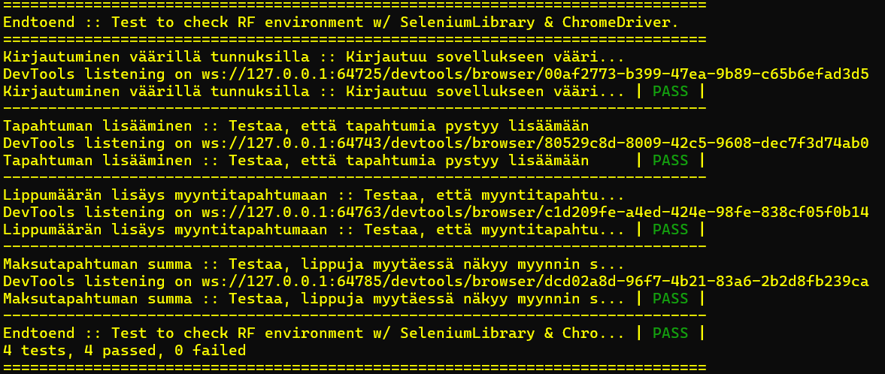

# Testisuunnitelma: End to end

## Testauksen tavoite

### Testattavat käyttäjätarinat
- Adminina haluan, että pystyä lisäämään uuden tapahtuman, jotta voin aloittaa lipunmyynnin tapahtumaan
- Myyjänä haluan muokata lippujen määriä myyntitilanteessa, jotta voin myydä asiakkaalle useamman lipun samalla kertaa
- Myyjänä haluan nähdä myytävien lippujen summan, jotta osaan laskuttaa asiakkaalta oikean määrän.


## Testit

 **Testattava asia**                | **Testin suoritus**
 ---------------------------------- | -------------------
 Kirjautuminen | Kirjaudutaan oikeilla tunnuksilla, ohjataan etusivulle. Kirjaudutaan väärillä tunnuksilla, annetaan virhe.
 Lisätään tapahtuma | Kirjauduttua adminina mennään hallinta-sivulle, lisätään uusi tapahtuma ja tarkistetaan että lisätty tapahtuma löytyy sivulta. 
 Tarkistetaan lippumäärä | Kirjauduttua siirrytään myynti-sivulle, lisätään lippuja myyntitapahtumaan, lasketaan että rivejä lisääntyy lippuja lisättäessä. 
 Tarkistetaan summa | Kirjauduttua siirrytään myynti-sivulle, myydään lippuja tapahtumaan, tarkistetaan ennen laskutusta, että summa näkyy sivulla. 

Testiloki 5.12.2024
=======================



**Testaaja:** Tiimi 7

**Ympäristö:** 

Selain: Chrome

Testattava osoite: https://op1-client-front-ohjelmistoprojekti.2.rahtiapp.fi/

Asennusympäristö:
 
 Python 3.12.6 / pip 24.2
```
    pip install robotframework
```
Robot Framework 7.1
```
    pip install robotframework-seleniumlibrary
```
Selenium Library 6.6.1

Testin ajo: 
```
    python -m robot endtoend.robot
```
