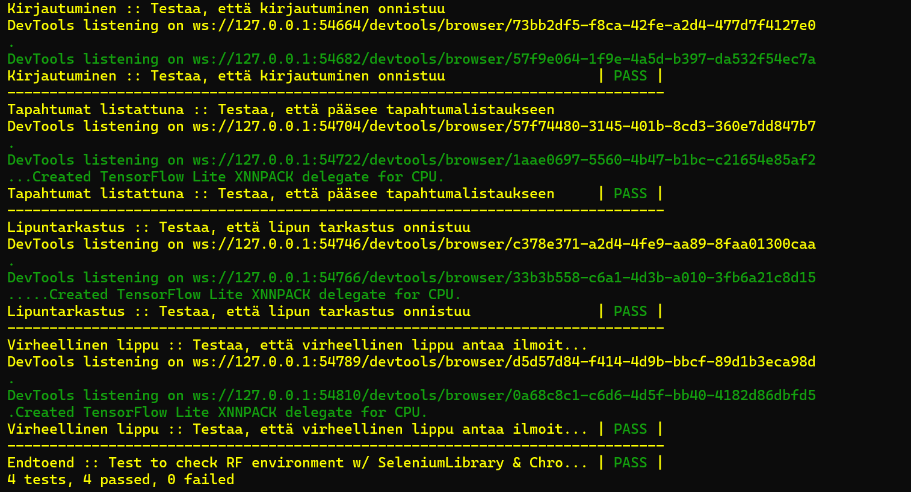

# Testisuunnitelma: End to end

## Testauksen tavoite

Testauksen tavoitteena on testata käyttäjän tekemiä toimintoja käyttöliittymässä. Tavoitteena oli tarkistaa, että toiminnallisuudet toimivat oikein jo kehitysvaiheessa. 

### Testattavat käyttäjän toiminnot
- Kirjautuminen
- Tapahtumien haku
- Lipun tarkastaminen
- Virheellisen lipun tarkastaminen 


## Testit

 **Testattava asia**                | **Testin suoritus**
 ---------------------------------- | -------------------
 Kirjautuminen | Kirjaudutaan oikeilla tunnuksilla, ohjataan etusivulle.
 Tapahtumien haku | Kirjauduttua, siirrytään myynti-sivulle ja tarkistetaan, että tapahtumat ovat listattuna.
 Lipun tarkastaminen | Kirjauduttua siirrytään tarkistus-sivulle, syötetään lippukoodi, painetaan tarkistus-painiketta ja tarkistetaan, että kenttä käytetty on true
 Virheellisen lipun tarkastaminen | Kirjauduttua siirrytään tarkistus-sivulle, syötetään virheellinen lippukoodi, painettua painiketta pitäisi ilmestyä virheilmoitus

Testiloki 20.11.2024
=======================



**Testaaja:** Tiimi 7

**Ympäristö:** 

Selain: Chrome

Testattava osoite: http://localhost:5173/

Asennusympäristö:
 
 Python 3.12.6 / pip 24.2
```
    pip install robotframework
```
Robot Framework 7.1
```
    pip install robotframework-seleniumlibrary
```
Selenium Library 6.6.1

Testin ajo: 
```
    python -m robot endtoend.robot
```

Löydökset:
----------

Ensimmäisestä end-to-end-testauksesta löytyy puutteita, joiden takia testit eivät täysin tarkastaneet sitä, mitä niiden olisi pitänyt tarkastaa. 

Testausta suorittaessa testin sisältö muuttui useasti ja testaus tavoitteet tulivat testattua, vaikka ne eivät lopullisessa testissä ole kirjattuna. 

Lisäksi huomioitavaa on, että ensimmäinen end-to-end testi ei mene läpi nykyistä järjestelmää testatessa.