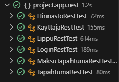

# Testisuunnitelma: Integraatiotesti

## Testauksen tavoite

Testauksen tavoitteena on testata, että entiteetti-luokat, niiden repositoryt ja REST-controllerit toimivat yhdessä. Testauksessa käytetään MockMVC-simulaatiota.

## Testit

 **Testattava asia**                | **Testin suoritus**
 ---------------------------------- | -------------------
HinnastoREST | Testataan, että endpoint palauttaa JSON-muotoista dataa. Testataan GET, POST, PATCH ja DELETE pyynnöt. 
KäyttäjäREST | Testataan, että endpoint palauttaa JSON-muotoista dataa. Testataan GET, POST, PATCH ja softdelete pyynnöt.
LippuREST | Testataan, että endpoint palauttaa JSON-muotoista dataa. Testataan GET, POST, PATCH, DELETE ja softdelete pyynnöt.
LoginREST | Testataan kirjautuminen POST-pyynnöillä oikeilla ja virheellisillä tunnuksilla. Tarkistetaan, että virheellinen tunnus palauttaa oikean virheviestin ja oikea tunnus palauttaa JWT-tokenin.
MaksutapahtumaREST | Testataan, että endpoint palauttaa JSON-muotoista dataa. Testataan GET, POST ja softdelete pyynnöt.
TapahtumaREST    | Testataan, että endpoint palauttaa JSON-muotoista dataa. Testataan GET, POST, PATCH ja DELETE pyynnöt.

Testiloki 10.12.2024
=======================

**Testaaja:** Tiimi7

**Ympäristö:**
- JUnit 
- Visual Studio Code + Extensions
    - Test Runner for Java
    - Extension Pack for Java

