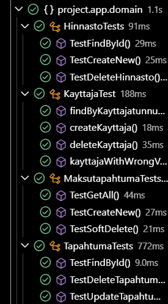

# Testisuunnitelma: Integraatiotesti

## Testauksen tavoite

Testauksen tavoitteena on testata, että entiteetti-luokat ja niiden repositoryt toimivat odotetusti. 

## Testit

 **Testattava asia**                | **Testin suoritus**
 ---------------------------------- | -------------------
Hinnaston ja Tapahtuman hakeminen id:llä | Testataan, että repository hakee oikealla id:llä 
Käyttäjän hakeminen käyttäjätunnuksella   | Testataan, että repository hakee oikealla käyttäjätunnuksella
Hinnaston, Käyttäjän ja Maksutapahtuman luonti | Testataan, että luonti onnistuu
Hinnaston, Käyttäjän, Tapahtuman poisto |   Testataan, että poistu onnistuu
Tapahtuman muokkaaminen     | Testataan, että muokkaus onnistuu
Käyttäjän luonti väärillä tiedoilla     | Testataan, että käyttäjän luonti väärillä tunnuksilla ei onnistu 
Haetaan maksutapahtumat, joiden removed-kenttä on false | Muutetaan luodun maksutapahtuman removed-kenttä true:ksi ja haetaan sen jälkeen tapahtumat, joiden removed-kenttä on false
Maksutapahtuman soft delete | Testataan, että maksutapahtuman soft delete (PATCH) onnistuu

Testiloki 20.11.2024
=======================

**Testaaja:** Tiimi7

**Ympäristö:**
- JUnit 
- Visual Studio Code + Extensions
    - Test Runner for Java
    - Extension Pack for Java

Testiloki 5.12.2024
=======================

**Testaaja:** Tiimi7

**Ympäristö:**
- JUnit 
- Visual Studio Code + Extensions
    - Test Runner for Java
    - Extension Pack for Java