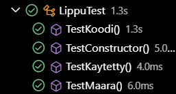

# Testisuunnitelma: Yksikkötesti

## Testauksen tavoite

Testauksen tavoitteena on testata Lippu-luokka ja varmistaa, että metodit palauttavat oikeat arvot. 

## Testit

 **Testattava asia**                | **Testin suoritus**
 ---------------------------------- | -------------------
Lippu-luokan prePersist | Testataan, että ennen tietokannan tallennusta suoritetut toimenpiteet toimivat oikein.
Lippu-luokan konstruktori | Testataan, että konstruktorin luomat olioiden arvot ovat oikeat ja odotetut.
Lippu-luokan metodit | Testataan, että metodit palauttavat oikeat arvot eri syötteillä ja virhetilanteet käsitellään oikein.

Testiloki 20.11.2024
=======================

**Testaaja:** Tiimi7

**Ympäristö:**
- JUnit 
- Visual Studio Code + Extensions
    - Test Runner for Java
    - Extension Pack for Java

Testiloki 5.12.2024
=======================

**Testaaja:** Tiimi7

**Ympäristö:**
- JUnit 
- Visual Studio Code + Extensions
    - Test Runner for Java
    - Extension Pack for Java