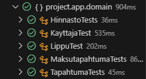

# Testisuunnitelma: Yksikkötesti

## Testauksen tavoite

Testauksen tavoitteena oli testata luodut entiteetit ja varmistaa, että ne palauttavat oikeat arvot. 

## Testit

 **Testattava asia**                | **Testin suoritus**
 ---------------------------------- | -------------------
Hinnasto-entiteetti | Testataan, että hakeminen ID:llä, uuden hinnaston luonti ja hinnaston poistaminen toimivat.
Kayttaja-entiteetti | Testataan, että hakeminen käyttäjätunnuksella, uuden käyttäjän luonti, käyttäjän poistaminen ja validointi toimivat.
Lippu-entiteetti | Testataan, että lipun ennen tallenusta suoritettavat toimenpiteet, konstruktorit, asettaminen käytetyksi ja määrän asettaminen toimivat.
Maksutapahtuma-entiteetti | Testataan, että maksutapahtumien haku, uuden maksutapahtuman luonti ja maksutapahtuman softdelete toimivat. 
Tapahtuma-entiteetti | Testataan, että tapahtuman hakeminen ID:llä, tapahtuman poistaminen ja tapahtuman päivittäminen toimivat.

Testiloki 10.12.2024
=======================

**Testaaja:** Tiimi7

**Ympäristö:**
- JUnit 
- Visual Studio Code + Extensions
    - Test Runner for Java
    - Extension Pack for Java

