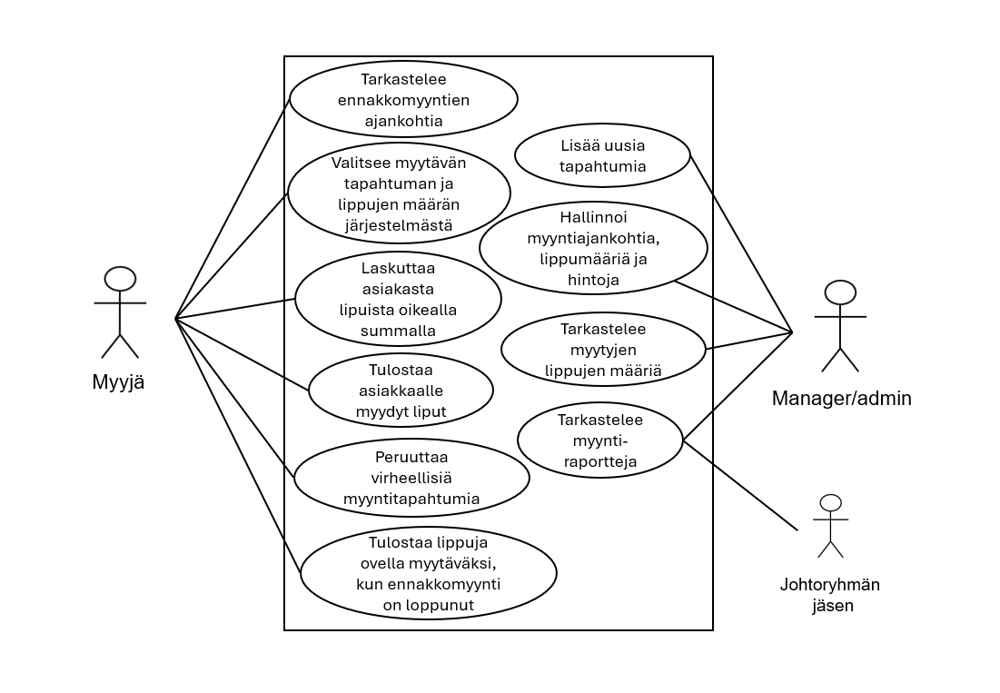

# Ohjelmistoprojekti 1

### Tiimi: 
Hiltunen Ilona, Järvinen Juho, Keinänen Aleksi, Klenberg Eriika, Nevala Sanni

## Johdanto

Kyseessä on Haaga-Helia ammattikorkeakoulun Ohjelmistoprojekti 1-kurssitoteutuksen projektityö, jonka tarkoituksena on luoda kuvitteellisen asiakkaan vaatima järjestelmä.

### Järjestelmä
Asiakkaana toimii lipputoimisto, joka tarvitsee lipunmyyntijärjestelmän myyntipisteeseen. Lipputoimiston myyjä myy ja tulostaa asiakkailleen liput tapahtumiin lipunmyyntijärjestelmästä. Lipputoimisto voi lisätä ja muokata lipunmyyntijärjestelmässä tapahtumia ja myytävien lippujen tietoja sekä nähdä koostetusti myyntitapahtumat ja myyntiraportit. Lipuissa on koodit, jotta liput voidaan merkitä käytetyksi asiakkaan saapuessa tapahtumaan. 

### Toteutus- ja toimintaympäristö
Projektissa tulemme käyttämään GitHubia versionhallintaan ja kehitystyöhön. Toimintaympäristömme pohjautuu Java-teknologioihin. Hyödynnämme Spring Boot-sovelluskehystä sekä palvelinpuolella toteutamme REST API-rajapinnan.
Käyttöliittymäteknologioista hyödynnämme React-kirjastoa. 

## Järjestelmän määrittely

### Käyttäjäryhmät 

Järjestelmässä on perustason käyttäjiä sekä admin-tason käyttäjiä. Lipunmyynnissä työskentelevillä myyjillä on peruskäyttäjän oikeudet, joilla voi hoitaa ja peruuttaa myyntitapahtumia, tulostaa lippuja sekä tarkastella ennakkomyyntien ajankohtia. Myymäläpäälliköllä sekä yrityksen johtoryhmän jäsenillä on admin-tason oikeudet, joilla voi peruskäyttäjän oikeuksien lisäksi lisätä uusia tapahtumia, hallinnoida ja tarkastella tapahtuman tietoja sekä tarkastella myyntiraportteja.

### Käyttötapauskaavio 

### Käyttötapausten kuvaus

Järjestelmän olennaisin tehtävä on myydä sekä tulostaa asiakkaalle lippuja. Myyntitapahtuman ollakseen onnistunut tarvitsee tähän tietenkin tukevia toimintoja, kuten virheellisten myyntitapahtumien peruutuksen ja hinnan hakemisen tietokannasta. Lisäksi, jotta ylimääräiset liput saadaan myytyä tulee ne voida tulostaa tapahtumassa ovelta myytäväksi. Jotta on lippuja mitä myydä tapahtumia tulee tietenkin myös voida luoda tapahtumia järjestelmään.

Yritystoimintaa ylläpitäville tahoille on tärkeää saada tietoa tapahtumista esimerkiksi yrityksen talouden hoitamisen vuoksi, joten järjestelmästä tulee pystyä näkemään tapahtumien tietoja kuten myytyjen lippujen määrää. Lisäksi mahdollisissa muutostilanteissa tulee tapahtuman tietoja pystyä muokkaamaan, jotta järjestelmän tieto ei ole virheellistä.

## Käyttöliittymä

Esitetään käyttöliittymän tärkeimmät (vain ne!) näkymät sekä niiden väliset siirtymät käyttöliittymäkaaviona. 

Jos näkymän tarkoitus ei ole itsestään selvä, se pitää kuvata lyhyesti.

## Tietokanta

Järjestelmään säilöttävä ja siinä käsiteltävät tiedot ja niiden väliset suhteet
kuvataan käsitekaaviolla. Käsitemalliin sisältyy myös taulujen välisten viiteyhteyksien ja avainten
määritykset. Tietokanta kuvataan käyttäen jotain kuvausmenetelmää, joko ER-kaaviota ja UML-luokkakaaviota.

Lisäksi kukin järjestelmän tietoelementti ja sen attribuutit kuvataan
tietohakemistossa. Tietohakemisto tarkoittaa yksinkertaisesti vain jokaisen elementin (taulun) ja niiden
attribuuttien (kentät/sarakkeet) listausta ja lyhyttä kuvausta esim. tähän tyyliin:

> ### _Tilit_
> _Tilit-taulu sisältää käyttäjätilit. Käyttäjällä voi olla monta tiliä. Tili kuuluu aina vain yhdelle käyttäjälle._
>
> Kenttä | Tyyppi | Kuvaus
> ------ | ------ | ------
> id | int PK | Tilin id
> nimimerkki | varchar(30) |  Tilin nimimerkki
> avatar | int FK | Tilin avatar, viittaus [avatar](#Avatar)-tauluun
> kayttaja | int FK | Viittaus käyttäjään [käyttäjä](#Kayttaja)-taulussa

## Tekninen kuvaus

Teknisessä kuvauksessa esitetään järjestelmän toteutuksen suunnittelussa tehdyt tekniset
ratkaisut, esim.

-   Missä mikäkin järjestelmän komponentti ajetaan (tietokone, palvelinohjelma)
    ja komponenttien väliset yhteydet (vaikkapa tähän tyyliin:
    https://security.ufl.edu/it-workers/risk-assessment/creating-an-information-systemdata-flow-diagram/)
-   Palvelintoteutuksen yleiskuvaus: teknologiat, deployment-ratkaisut yms.
-   Keskeisten rajapintojen kuvaukset, esimerkit REST-rajapinta. Tarvittaessa voidaan rajapinnan käyttöä täsmentää
    UML-sekvenssikaavioilla.
-   Toteutuksen yleisiä ratkaisuja, esim. turvallisuus.

Tämän lisäksi

-   ohjelmakoodin tulee olla kommentoitua
-   luokkien, metodien ja muuttujien tulee olla kuvaavasti nimettyjä ja noudattaa
    johdonmukaisia nimeämiskäytäntöjä
-   ohjelmiston pitää olla organisoitu komponentteihin niin, että turhalta toistolta
    vältytään

## Testaus

Tässä kohdin selvitetään, miten ohjelmiston oikea toiminta varmistetaan
testaamalla projektin aikana: millaisia testauksia tehdään ja missä vaiheessa.
Testauksen tarkemmat sisällöt ja testisuoritusten tulosten raportit kirjataan
erillisiin dokumentteihin.

Tänne kirjataan myös lopuksi järjestelmän tunnetut ongelmat, joita ei ole korjattu.

## Asennustiedot

Järjestelmän asennus on syytä dokumentoida kahdesta näkökulmasta:

-   järjestelmän kehitysympäristö: miten järjestelmän kehitysympäristön saisi
    rakennettua johonkin toiseen koneeseen

-   järjestelmän asentaminen tuotantoympäristöön: miten järjestelmän saisi
    asennettua johonkin uuteen ympäristöön.

Asennusohjeesta tulisi ainakin käydä ilmi, miten käytettävä tietokanta ja
käyttäjät tulee ohjelmistoa asentaessa määritellä (käytettävä tietokanta,
käyttäjätunnus, salasana, tietokannan luonti yms.).

## Käynnistys- ja käyttöohje

Tyypillisesti tässä riittää kertoa ohjelman käynnistykseen tarvittava URL sekä
mahdolliset kirjautumiseen tarvittavat tunnukset. Jos järjestelmän
käynnistämiseen tai käyttöön liittyy joitain muita toimenpiteitä tai toimintajärjestykseen liittyviä asioita, nekin kerrotaan tässä yhteydessä.

Usko tai älä, tulet tarvitsemaan tätä itsekin, kun tauon jälkeen palaat
järjestelmän pariin !
